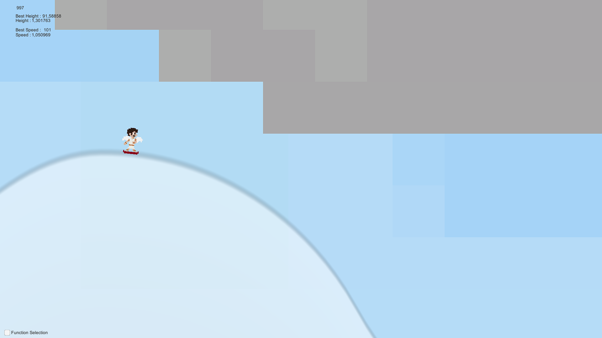
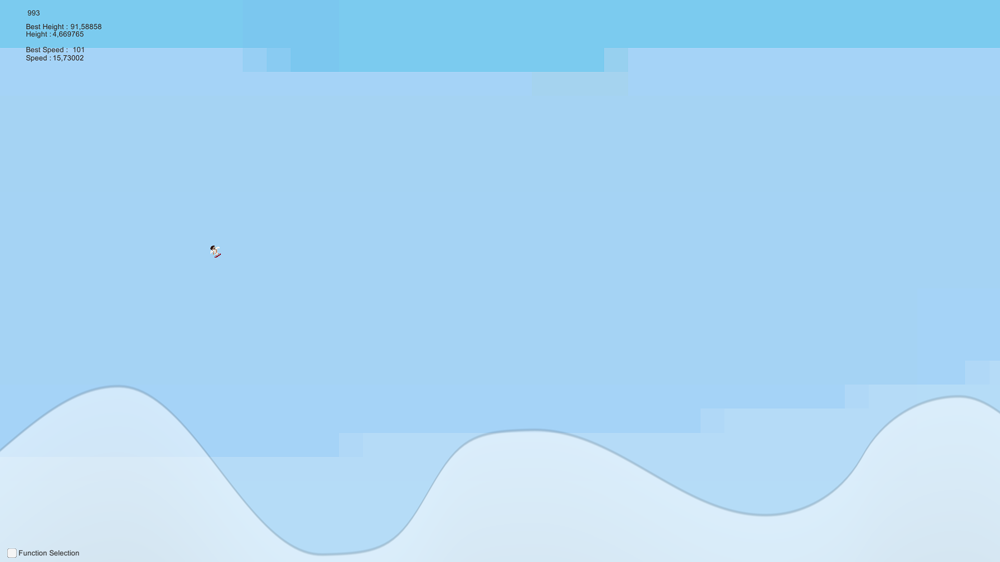

# PetiteZaile

    

     
     
     

## Description
PetiteZailes is a Unity game made as a student project inspired by TinyWings.
This project purpose was to use mathematical formula and shaders, to dynamically create and display a path for the player.
It can be played on PC or on Android

## Controls
Touch the screen on phone or press the space bar on keyborad to increase your falling speed

# My work
On the project I was in charge of :
    - The display of the path (combination of scripts and shaders)
    - The player control and physic
    - Assets creation

## Credits

FIGUEIREDO Alex           
PETIT Denis               
